<!-- toc -->
- [はじめに](#はじめに)
  - [概要](#概要)
  - [用語説明](#用語説明)
    - [継続渡しスタイル（Continuation Passing Style : CPS）](#継続渡しスタイルcontinuation-passing-style--cps)
    - [Suspend 関数](#suspend-関数)
    - [非ブロッキング処理](#非ブロッキング処理)
  - [Suspend 関数に対するコンパイラの処理](#suspend-関数に対するコンパイラの処理)
    - [Suspend 関数の変形](#suspend-関数の変形)
    - [状態クラス](#状態クラス)
    - [Suspend 関数処理の流れ](#suspend-関数処理の流れ)
  - [非同期関数をラップして独自の Suspend 関数を作成する方法](#非同期関数をラップして独自の-suspend-関数を作成する方法)
  - [参考文献](#参考文献)
  - [参考サイト](#参考サイト)

# はじめに
この章では、Coroutine の主たる機能である、Suspend 関数の動作原理について記載する。
なお、この章の記述内容は、公式のドキュメントでは、説明されていないため、
各種情報を参考に記載している。
そのため、実際の原理とは異なる可能性がある。

## 概要
Suspend 関数は、コンパイラによって、継続渡しスタイルに変形される。
その際に、関数内処理の Suspend 関数を区切りとして、処理を中断できる構造に変形される。
それにより、非ブロッキング処理が行えるようになる。

## 用語説明

### 継続渡しスタイル（Continuation Passing Style : CPS）
>継続渡しスタイルで書かれた関数は、
>通常の直接スタイル (direct style) のように値を「返す」かわりに、
>「継続」を引数として陽に受け取り、その継続に計算結果を渡す。  
>継続とは、関数の計算結果を受け取るための（一般には元の関数とは別の）1引数の関数のことである。
>
>フリー百科事典『ウィキペディア（Wikipedia）』 (最終更新 2019年4月2日).　継続渡しスタイル.  
>https://ja.wikipedia.org/wiki/%E7%B6%99%E7%B6%9A%E6%B8%A1%E3%81%97%E3%82%B9%E3%82%BF%E3%82%A4%E3%83%AB

CPS については、以下の参考文献も参考となる。

M.Hiroi.　Functional Programming　お気楽 Scheme プログラミング入門.　(2020年3月26日 閲覧)  
　　http://www.nct9.ne.jp/m_hiroi/func/abcscm20.html  

### Suspend 関数
Suspend 関数（中断関数）は、Coroutine 処理中で利用できる、呼び出し元スレッドを中断する機能を持った関数である。
Suspend 関数は、suspend アクセス修飾子を関数の宣言に付与することにより定義できる。

### 非ブロッキング処理
[Coroutine の基礎](10_basics.md) を参照。

## Suspend 関数に対するコンパイラの処理
suspend アクセス修飾子を付与した関数は、コンパイラによって以下のような処理が行われる。

- Suspend 関数の変換
- Suspend 関数の状態を保持するクラス（状態クラス）の生成

### Suspend 関数の変形
以下のような、Suspend 関数の変換が行われる。
ライブラリで用意されている Suspend 関数（delay など）も、同様に変形される。

- コールバック用の引数を追加
- 処理を Suspend 関数を境としてブロックに分割
- 各処理ブロックの開始で、状態クラスからローカル変数を復元するコードを追加

### 状態クラス
状態クラスは、以下の役割を持つ。

- 中断時に関数内のローカル変数を保持する
- 次の実行対象ブロックを保持する
- 前のブロックの実行結果を受け取り、次のブロックを実行するコールバックメソッドを持つ
  つまり、Suspend 関数に渡すコールバックの実態となる

### Suspend 関数処理の流れ
ここでは、Suspend 関数が、実際にどのように処理されるのかを、かなり大雑把に説明する。
したがって、正確な表現となっていない。

変換に関する詳しい説明は、参考文献を参照。

Suspend 関数は、処理終了後にコールバックの resumeWith 関数を呼び出す責任がある。
このようなスタイルは、継続渡しスタイル（CPS）と呼ばれる。
ただし、作成した Suspend 関数からは、直接 resumeWith 関数を呼び出すことはなく。
処理内で呼び出したライブラリで用意されている Suspend 関数（delay など）に、
コールバックを渡すのみとなる。
最終的に、ライブラリで用意されている Suspend 関数内で resumeWith 関数を呼び出す。

Suspend 関数中断後の処理再開は、必要なデータのみを復元すれば良いので、
スレッドに比べ、コンテキストスイッチコストが少ない。

元のコード

```kotlin
class SusClass {
    suspend fun susAll(a: Int): Int {
        // 通常関数呼び出し
        val b = normalFun(a)
        // Suspend 関数呼び出し
        val b2 = susB(b)
        // 通常関数呼び出し
        val c = normalFun(b2)
        // Suspend 関数呼び出し
        val c2 = susC(c)
        // 通常関数呼び出し
        val d = normalFun(c2)
        return d
    }
}
```

変換後の疑似コード。  
以下の擬似コード(実際にはバイナリコードとなっている)で変換後の処理を表現した。
実行はできない。

```kotlin
// 状態クラス（自動生成）のイメージ実装
// 実際には、このようなソースが生成されるわけではなく、バイトコードとなる。
class StateX(
    private val target: SusClass,
    private val originalCallback: Continuation<Int>
) : Continuation<Int> {
    // 次の処理ブロック
    var label: Int = 1
    // 前の処理結果値
    var result: Int = 0

    // このメソッドは、説明範囲外なので無視
    override val context: CoroutineContext
        get() = TODO("Coroutine コンテキストを返す")

    // このメソッドは、実際の実装とは異なる。
    override fun resumeWith(result: Result<Int>) {
        // 処理結果を保持
        this.result = result.getOrThrow()
        // 次の処理ブロックを呼び出し、戻り値を取得
        val outcome = target.susAll(10, this)
        // 戻り値によって、中断するか、コールバックを呼び出す。
        if (outcome === COROUTINE_SUSPENDED) return
        // コールバックで、結果を返す。
        originalCallback.resumeWith(Result.success(outcome) as Result<Int>)
    }
}

// 実装したクラスから変換されたクラス
class SusClass {
    // 変形後の Suspend 関数
    fun susAll(a: Int, callback: Continuation<Int>): Any? {
        // 状態クラスインスタンス
        val stateX = when (callback) {
            // 自分の状態クラスの場合はそのまま利用する
            is StateX -> callback
            // 初回呼び出し時には、自分の状態クラスでラップする
            else -> StateX(this, callback)
        }

        // ブロックに分割される
        when (stateX.label) {
            1 -> {
                // 初期値
                val b = stateX.result

                // 通常関数で処理を行う
                val b2 = normalFun(b)

                // 次の処理ブロックを設定
                stateX.label = 2
                // ブロックの最後は、Suspend 関数呼び出しとなる
                return susB(b2, stateX)
            }
            2 -> {
                // 前の処理の結果を取得
                val c = stateX.result

                // 通常関数で処理を行う
                val c2 = normalFun(c)

                // 次の処理ブロックを設定
                stateX.label = 3
                // ブロックの最後は、Suspend 関数呼び出しとなる
                return susC(c2, stateX)
            }
            3 -> {
                // 前の処理の結果を取得
                val d = stateX.result

                val d2 = normalFun(d)

                // 最後は、値を返す
                return d2
            }
            else -> throw IllegalStateException()
        }
    }
}

// これは、便宜上定義している
const val COROUTINE_SUSPENDED = ""

// 通常関数
fun normalFun(b: Int): Int {
    return b * 2
}

// ライブラリで用意されている（プリミティブ）中断関数 B
fun susB(b: Int, callback: Continuation<Int>): Int {
    return suspendCoroutine {continuation ->
        // プリミティブ中断関数では、必ず resumeWith を呼び出すようになってる
        continuation.resumeWith(Result.success(123))
    }
}

// ライブラリで用意されている（プリミティブ）中断関数 C
fun susC(b: Int, callback: Continuation<Int>): Int {
    return suspendCoroutine {continuation ->
        // プリミティブ中断関数では、必ず resumeWith を呼び出すようになってる
        continuation.resumeWith(Result.success(456))
    }
}
```



## 非同期関数をラップして独自の Suspend 関数を作成する方法
以下のように suspendCoroutine ビルダを利用する。

```kotlin
suspend fun suspendGet(a: Int): Int {
    return suspendCoroutine {continuation ->
        continuation.resumeWith(Result.success(123))
    }
}
```

## 参考文献
有野和真.　Suspend関数のはなし Kindle版.　(2019年10月7日 購入)  
　　https://www.amazon.co.jp/gp/product/B07MDXF3YZ

## 参考サイト
Garth Gilmour, Eamonn Boyle (JAN 11, 2020).　A Bottom-Up View of Kotlin Coroutines.  
　　https://www.infoq.com/articles/kotlin-coroutines-bottom-up/  
　　（訳）Kotlinのコルーチンを実装面から検証する  
　　https://www.infoq.com/jp/articles/kotlin-coroutines-bottom-up/

Toshihiro Yagi (2018年8月25日).　Kotlin コルーチンを 理解しよう.  
　　https://speakerdeck.com/sys1yagi/kotlin-korutinwo-li-jie-siyou  
>スライドによる説明

菊田遥平.　Kotlin Coroutine の勉強経過記録.  
　　https://yoheikikuta.github.io/study_kotlin_coroutine/  
> 参考となる動画へのリンクが豊富にある。
